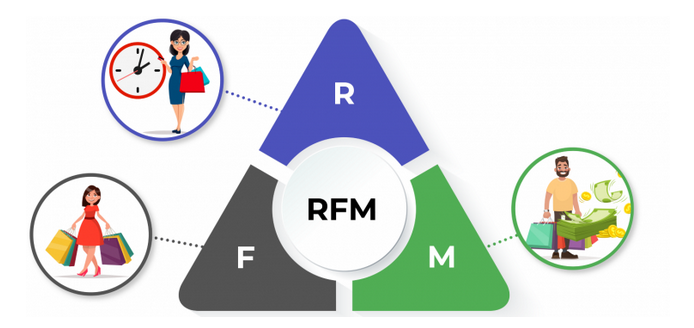
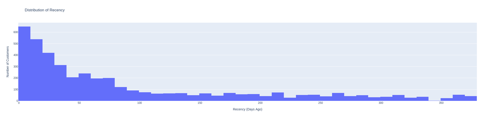
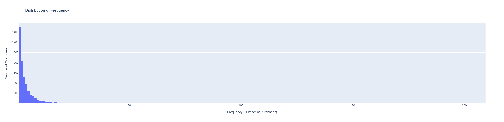
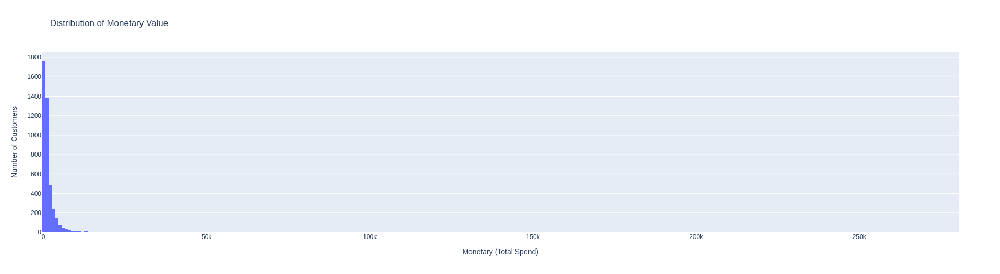
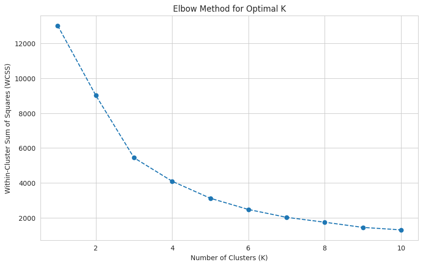
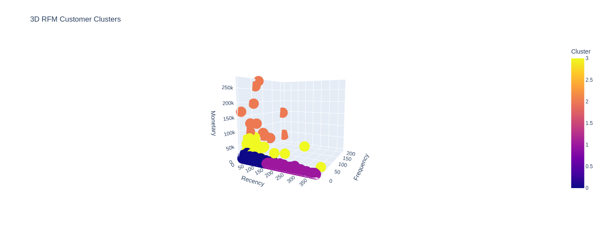

# E-commerce Customer Insights and RFM Segmentation


> The image was taken from this [Linkedin post](https://www.linkedin.com/pulse/how-conduct-rfm-analysis-improve-your-business-strategy-sifat/)

An end-to-end Data Analytics project utilizing Python and SQL principles to transform raw transactional data into actionable business intelligence. By implementing a [Recency, Frequency, and Monetary (RFM) model](https://en.wikipedia.org/wiki/RFM_(market_research)), this project segments over 4,300 unique customers to identify high-value "Champions" and at-risk users.

## Business Impact
* Data Integrity: Cleaned and validated a raw dataset of 541k+ records, ensuring 100% referential integrity for analytical reporting.
* Behavioral Insights: Quantified customer value into distinct segments (Champions, Loyal, At-Risk, Regulars), providing a framework for targeted marketing and retention strategies.
* Automated Pipeline: Developed a Python-based processing engine that automates data cleaning and feature engineering, reducing the time from raw data to insight discovery.

## Tech Stack
* Language: Python (Pandas, NumPy, datetime, sklearn)
* Visualization: Plotly (Interactive Dashboards), Matplotlib, Seaborn
* Concepts: RFM Modeling, Exploratory Data Analysis (EDA), Statistical Distribution, Data Cleaning.
* Datasets: [ucimlrepo](https://archive.ics.uci.edu/dataset/352/online+retail) `(id=352)`

## Methodology and Key Findings

### 1. Data Engineering and Cleaning
Leveraging a background in software reliability, I processed the UCI Online Retail Dataset by:
* Removing null CustomerID values to ensure segment accuracy.
* Filtering out transaction cancellations and non-positive quantities.
* Engineering a TotalSales feature to track gross revenue per transaction.

### 2. RFM Calculation

I calculated three core metrics for each of the 4,338 unique customers:
* Recency: Days since the last purchase/snapshot **(identifying engagement)**.
* Frequency: Total number of unique invoices **(identifying loyalty)**.
* Monetary: Total spending **(identifying revenue contribution)**.

### 3. Interactive Visualization
The project features a dynamic dashboard (built with Plotly) that allows stakeholders to:
* Identify the correlation between purchase frequency and total spend.
* Visualize the distribution of customer segments through interactive 3D Clusters and histograms.
* Drill down into specific customer cohorts to optimize acquisition costs.

#### 3.1. Below are the screenshots of the generated plots

<p align="center">Histogram Distribution for Recency</p>


<p align="center">Histogram Distribution for Frequency</p>


<p align="center">Histogram Distribution for Monetary</p>


<p align="center">Scatter plot for Frequency vs Monetary</p>


<p align="center">Elbow Method for Optimal K Clustering</p>


<p align="center">3D RFM Customer Clusters</p>

> NOTE: every plot shown here are interactive except `elbow method graph`

## How to Run

<details>
<summary>🔨 Manual Build</summary>

1. Clone this repository.
2. Open [RFM.ipynb](RFM.ipynb) in Google Colab or Jupyter Notebook.
3. Install dependencies:
  
```python
pip install pandas matplotlib seaborn plotly ucimlrepo
```
> NOTE: Google Collab already preinstalled everything except `ucimlrepo`

4. Run all cells to generate the interactive dashboard.
</details>

<details>
<summary>🔗 Google Collab Link</summary>

1. Click this Google Collab [link](https://colab.research.google.com/drive/1laIJbLEEMY-9b0zpW-Fy0z5NiS99p4XU?usp=sharing)
2. Run All

</details>

---

<p align="center">😁 Thank you for visiting</p>
